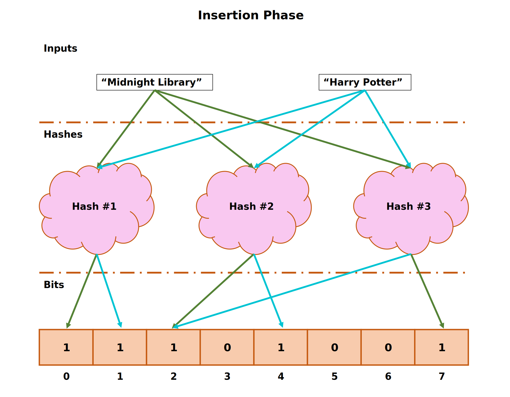
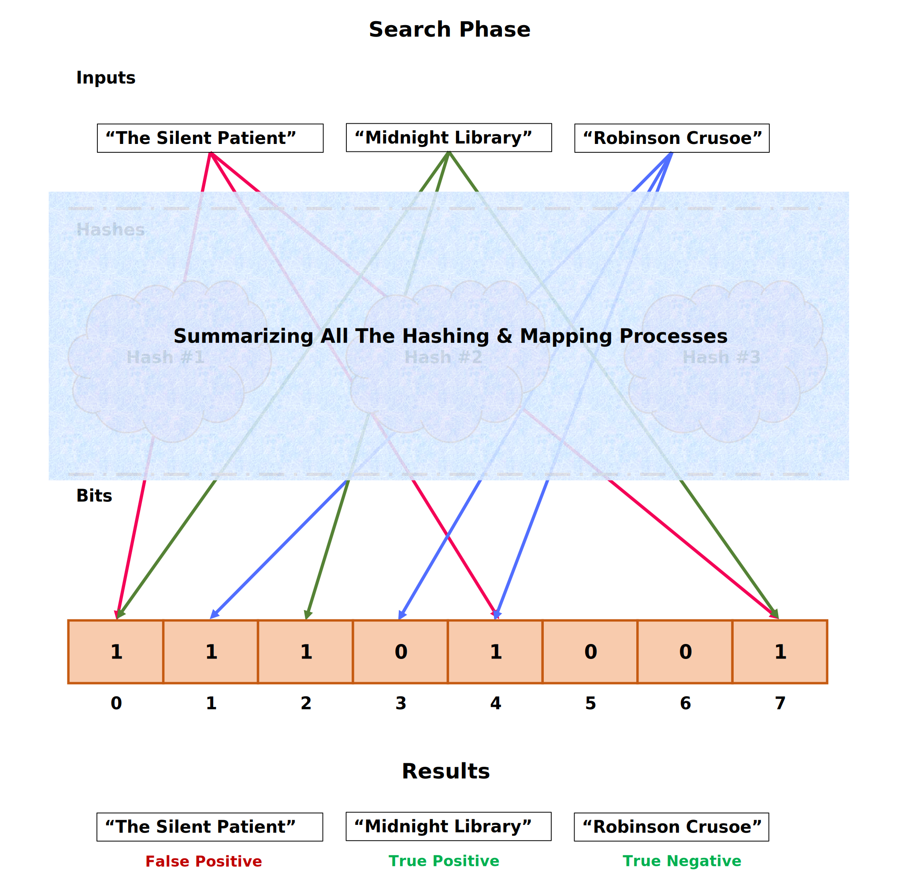
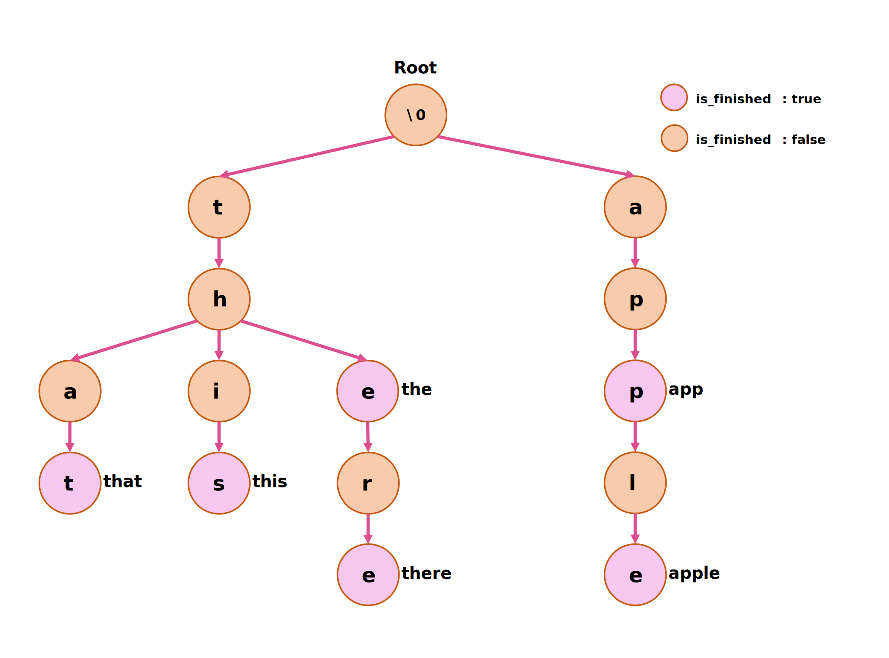

<h1 align="center">
<strong>AUT_AP_2024_Spring Homework 3</strong>
</h1>

<p align="center">
<strong> Deadline: 7th of Ordibehesht - 23:59 o'clock</strong>
</p>

# Bloom Filter Data Structure (Understanding)

<p align="center">
  
</p>

A **Bloom Filter** is a space-efficient **probabilistic** data structure that is used to test whether an element is a member of a set. **False positive matches are possible**, but false negatives are not. In other words, a query returns either **"possibly in set"** or **"definitely not in set"**. Bloom Filters are very effective when the goal is to reduce the use of resources (like network bandwidth or disk space) at the cost of a slight probability of error.

## Key Characteristics

- **Space Efficiency**: Uses much less space than other data structures for similar tasks.
- **Probability of Errors**: Allows for a small percentage of false positives which can be controlled based on the Bloom Filter's size and the number of hash functions used.
- **No Element Removal**: Elements can be added to the set, but not removed (although extensions like Counting Bloom Filters support this).

## Common Operations

- **Add**: Insert an element into the Bloom Filter by using multiple hash functions to set bits in a bit array.
- **Query**: Check for the presence of an element in the Bloom Filter. If any of the bits are not set, the element is definitely not in the set. If all are set, the element **might be in the set**.
- **Merge**: Combine two Bloom Filters into one that represents the union of their sets.

<p align="center">
  
</p>

## Use Cases

- **Network Systems**: Used in network routers to quickly check if a URL or a resource is cached.
- **Database Systems**: Employed to avoid expensive disk or network operations by checking the Bloom Filter first.
- **Distributed Systems**: Helps in reducing synchronization and data transfer by efficiently testing whether an element is in a remote set.
- **Caching Mechanisms**: Enhances cache eviction policies by tracking which objects are likely not in use.
- **Spell Checkers**: To quickly check if a word is potentially misspelled before a more resource-intensive lookup.

## Advantages

- **Highly Efficient Query Time**: Nearly constant time for add and query operations, independent of the number of elements in the filter.
- **Reduced Resource Usage**: Minimizes the need for additional memory or bandwidth.
- **Scalability**: Effectively handles a large number of elements with a manageable increase in the likelihood of false positives.

## Implementation Considerations

- **Optimal Number of Hash Functions**: The number of hash functions should be optimized to balance between the time complexity of queries and the false positive rate.
- **Bit Array Size**: The size of the bit array affects both the space usage and the probability of false positives.
- **Hash Function Choice**: Hash functions must be fast and distribute the elements uniformly across the bit array.

---

# Bloom Filter Data Structure (Implementation Guide)

## BloomFilter Class

### Constructors & Destructor

- **Constructor**: Initializes the `BloomFilter` with a specified number of hash functions. setting up the required environment for operations.
- **Copy Constructor**: Ensures that when a `BloomFilter` is copied, all the internal states (like the bit array and hash seeds) are correctly duplicated.
- **Move Constructor**: Efficiently transfers the internal state from one `BloomFilter` to another, optimizing performance by avoiding deep copying.
- **Destructor**: Handles clean-up, ensuring no resources are leaked and the Bloom filter's internal state is properly disposed of.

### Functional Methods

- **add**: Inserts an item into the `BloomFilter` by setting bits in the bit array based on the output of hash functions. Overloaded to handle strings directly or through files.
- **possiblyContains**: Checks if an item might be in the `BloomFilter`. If any of the bits checked by the hash functions are not set, the item is definitely not in the set; otherwise, it might be.
- **certainlyContains**: Combines the probabilistic check of the `BloomFilter` with a definitive check using an integrated `CDNServer`. This method is crucial for confirming item presence without false positives.
- **reset**: Clears the `BloomFilter`, resetting all bits in the bit array for reuse.

### Operator Overloads

- **& and |**: Implements intersection and union operations between two `BloomFilter` instances, modifying the current instance to represent the result.
- **()**: Provides a quick and intuitive way to check for item presence using the `possiblyContains` method.

### I/O Operators

- **<< and >>**: Facilitates reading from and writing to streams, which is essential for saving and loading the state of a `BloomFilter`.

### Private Members and Methods

- **bits**: A `std::bitset` used to represent the presence of elements. The size of this bitset is templated to allow for flexible storage based on use-case requirements.
- **num_hashes**: Stores the number of hash functions used, affecting the accuracy and performance of the `BloomFilter`.
- **seeds**: A vector of seeds for the hash functions, ensuring that each hash function produces unique and evenly distributed results.
- **server**: A pointer to a `CDNServer` instance used for definitive checks, bridging the gap between probabilistic and certain results.
- **hash**: A private method that computes the hash for an item using a given seed, central to the functionality of the `BloomFilter`.

### Implementation Tips

- **Memory Management**: Pay attention to resource management, especially in constructors and the destructor, to avoid memory leaks.
- **Hash Function Choice**: Ensure hash functions are well-distributed to minimize collisions and false positives.
- **Integration with CDNServer**: Handle interactions carefully to ensure that the `BloomFilter` correctly utilizes the `CDNServer` for definitive checks.

---

# BloomFilter Class (Header file)

```cpp
#ifndef BLOOM_FILTER_H
#define BLOOM_FILTER_H

#include <vector>
#include <functional>  // Included for std::hash
#include <bitset>      // Included for std::bitset

#include "CDNServer.h" // Dependency for checking definitively if an item is in the dataset

// BloomFilter class template for probabilistic set membership checking
template <std::size_t N = 81920>  // Default size of the Bloom filter bit array set to 81920 bits (10 kilobytes)
class BloomFilter {
public:
    // Constructor initializing the number of hash functions
    BloomFilter(unsigned int num_hashes);

    // Copy constructor
    BloomFilter(const BloomFilter& other);

    // Move constructor with noexcept specifier for optimal performance
    BloomFilter(BloomFilter&& other) noexcept;

    // Destructor
    ~BloomFilter();

    // Add an item to the Bloom filter
    void add(const std::string& item);
    // Overload for adding items from a file, where words are assumed to be separated by ", "
    void add(std::string&& file_name="words_expect_true.txt");

    // Check if an item might be in the Bloom filter
    bool possiblyContains(const std::string& item) const;
    // Overload for r-value references, forwards to the l-value reference version
    bool possiblyContains(std::string&& item) const;

    // Definitive check for an item's presence combining Bloom filter and CDNServer
    bool certainlyContains(const std::string& item) const;
    // Overload for r-value strings
    bool certainlyContains(std::string&& item) const;

    // Reset the Bloom filter, clearing all set bits
    void reset();

    // Operator overloads for combining Bloom filters
    BloomFilter& operator&(const BloomFilter& other); // Intersection of two filters
    BloomFilter& operator|(const BloomFilter& other); // Union of two filters

    // Operator to check direct access, same as possiblyContains
    bool operator()(const std::string& item) const;

    // I/O operators for reading and writing Bloom filter states
    friend std::ostream& operator<<(std::ostream& os, const BloomFilter& bloom_filter); // Output stream operator
    friend std::istream& operator>>(std::istream& is, BloomFilter& bloom_filter); // Input stream operator

private:
    // Bit array to represent elements presence probabilistically
    std::bitset<N> bits;

    // Number of hash functions used in this filter
    std::size_t num_hashes;

    // Seeds for the hash functions to ensure diversity
    std::vector<std::size_t> seeds;

    // Pointer to a CDNServer used to definitively check items
    CDNServer* server;

    // Private method to hash an item using a specific seed
    std::size_t hash(const std::string& item, std::size_t seed) const {
        std::hash<std::string> hasher;
        return hasher(item + std::to_string(seed));  // Concatenate the seed to the item before hashing
    }
};

#endif // BLOOM_FILTER_H
```

---

# CDNServer Class (Header file, Already Implemented)

```cpp
#ifndef CDNSERVER_H
#define CDNSERVER_H

#include <string>
#include <unordered_set>

// CDNServer class manages a set of strings and provides functionality to check the presence of items
class CDNServer {
public:
    // Constructor initializes the server with a usage count of zero
    CDNServer() : usage_count(0) {}

    // Adds a word to the server's internal storage
    void addWord(const std::string& word) {
        words.insert(word);  // Insert the word into the unordered set
    }

    // Checks if a word exists in the server's storage and increments the usage count
    bool checkWord(const std::string& word) {
        ++usage_count;  // Increment usage count with each check
        return words.find(word) != words.end();  // Return true if the word is found
    }

    // Returns the number of times the server has been queried
    size_t getUsageCount() const {
        return usage_count;  // Provide the total usage count
    }

    // Estimates the memory usage of the server's data in kilobytes
    double RAMUsage() const {
        size_t total_memory = 0;
        for (const auto& word : words) {
            // Calculate memory used by each string including its storage overhead
            total_memory += sizeof(std::string) + word.capacity() * sizeof(char);
        }
        // Add the memory used by the unordered_set's internal structures
        total_memory += words.bucket_count() * sizeof(void*);
        return static_cast<double>(total_memory) / 1024.0;  // Convert bytes to kilobytes
    }

private:
    std::unordered_set<std::string> words;  // Container to store unique words
    size_t usage_count;                     // Counter for the number of queries made to the server
};

#endif // CDNSERVER_H
```

---

# Trie Data Structure (Understanding)

<p align="center">
  
</p>

A **Trie**, also known as a prefix tree or digital tree, is a kind of search tree used in computer science to store a dynamic set or associative array where the keys are usually strings. Unlike a binary search tree, no node in the tree stores the key associated with that node. Instead, its position in the tree defines the key with which it is associated, and all the descendants of a node have a common prefix of the string associated with that node.

## Key Characteristics

- **Prefix-Based**: Each node holds a common part of one or more strings, making it efficient for scenarios where many strings share the same prefix.
- **Space Optimization**: Tries can use less space when storing many keys with the same prefix. This space advantage becomes significant when dealing with a large set of strings.
- **Time Complexity**: Offers **optimal** time complexity for look-up, insert, and delete operations, often proportional to the length of the word being looked up or modified.

## Common Operations

- **Insert**: Add a string to the Trie, one character at a time, by traversing from the root to the appropriate child nodes.
- **Search**: Check for the presence of a string in the Trie by traversing the nodes corresponding to each character of the string.
- **Delete**: Remove a string from the Trie, which can involve clearing nodes that are no longer needed.
- **Prefix Search**: Useful for autocomplete features, where all entries with a common prefix are retrieved.

## Use Cases

- **Autocomplete**: Widely used in search engines and text editors to suggest completions for partially typed words.
- **Spell Checkers**: Helps in quickly finding correct spellings by comparing input words against a dictionary stored in a Trie.
- **IP Routing**: Used to store IP routing prefixes for quick lookup and efficient storage.
- **Text Analytics**: Utilized in natural language processing for tasks such as morphology analysis.
- **Bioinformatics**: Applied in genomics for efficient storage and search of large genomic data sets.

## Advantages

- **Fast Lookup**: Retrieval times can be faster than hashing for certain datasets, especially when dealing with a group of strings that share common prefixes.
- **Efficiency in Storage for Large Datasets**: Particularly effective at minimizing memory consumption when handling sets of strings with overlapping prefixes.
- **Flexible Size**: The size of a Trie can dynamically adjust based on its contents, which is ideal for situations where the dataset varies over time.

## Implementation Considerations

- **Node Structure**: Each node typically contains an array of child nodes (one for each possible alphabetic value), a boolean flag to mark the end of a word, and potentially a value associated with the key.
- **Space vs. Speed Trade-offs**: While Tries improve speed for certain operations, they can consume more memory than other data structures like hash tables, especially when storing sparse data sets.
- **Complexity of Operations**: Implementing operations like delete can be more complex in Tries due to the need to clean up unused nodes.

---

# Trie Data Structure (Implementation Guide)

## Node Class

- **Constructor**:
  - Initializes a node with optional character data and a boolean indicating if it's the end of a word.
  - Each node contains an array of child node pointers (`children`), facilitating the Trie structure.
- **Destructor**: Responsible for managing the deletion of children nodes to prevent memory leaks.

## Trie Class

### Constructors & Destructor

- **Default Constructor**: Initializes the Trie with a root node set to `nullptr` or an equivalent empty state.
- **Copy Constructor**: Creates a new Trie as a deep copy of another Trie, ensuring all nodes are copied correctly.
- **Move Constructor**: Transfers the internal state of one Trie to another, adopting the resources without copy overhead.
- **Initializer List Constructor**: Allows initialization with a list of words (e.g., `Trie myTrie{"hello", "world"};`).
- **Destructor**: Cleans up all resources, ensuring all dynamically allocated nodes are properly deleted.

### Assignment Operators

- **Copy Assignment**: Ensures deep copying of Trie structures, similar to the copy constructor.
- **Move Assignment**: Transfers resources from one Trie to another, nullifying the moved-from Trie.

### Basic Trie Operations

- **insert**: Adds a new word to the Trie, allocating nodes as necessary for each character of the string.
- **search**: Returns `true` if a particular word is present in the Trie.
- **startsWith**: Checks if any word in the Trie starts with the given prefix.
- **remove**: Deletes a word from the Trie, potentially removing nodes that are no longer needed.

### Traversal and Utility

- **bfs (Breadth-First Search)**: Performs a breadth-first traversal of the Trie, applying a provided function (`func`) to each visited node. (**Hint**: Use Queue 🙂)
- **dfs (Depth-First Search)**: (**BONUS POINTS**) Performs a depth-first traversal of the Trie, applying a provided function (`func`) to each visited node. (**Hint**: Use Stack 🙂)

### I/O Operators

- **operator<< (Output)**: Allows a Trie to be printed to an output stream, displaying all words or structured data.
- **operator>> (Input)**: Enables initialization or modification of a Trie from an input stream.

### Additional Operators

- **operator+ and operator+=**: Used for combining two Tries, either creating a new one or adding to an existing one.
- **operator- and operator-=**: Facilitates the removal of words found in one Trie from another.
- **operator()**: an interface for checking existence of a word in the trie.
- **operator== and operator!=**: For comparing two Tries, checking if they contain the same set of words.

### Private Members

- **root**: Points to the root node of the Trie, which is the starting point for all operations.

## Implementation Tips

- Ensure that memory management is handled carefully, especially in constructors, destructors, and assignment operators to avoid leaks and dangling pointers.
- Consider edge cases in your Trie operations, such as inserting duplicate words, removing non-existent words, and handling special characters if necessary.
- Optimize the Trie's node structure if needed to handle different alphabets beyond simple lowercase English letters.

---

# Trie Class (Header file)

```cpp
#ifndef TRIE_H
#define TRIE_H

#include <array>
#include <string>
#include <initializer_list>
#include <functional>
#include <iostream>

class Trie {
public:
    class Node {
    public:
        Node(char data = '\0', bool is_finished = false);
        ~Node(); // To manage deletion of children nodes

        Node* parent; // Pointer to the parent node, parent of the root is "nullptr"
        std::array<Node*, 26> children; // Array of 26 Node pointers, covering English alphabet
        char data; // data for root node is "\0"
        bool is_finished;
    };

    // Constructors
    Trie();
    Trie(const Trie& other);
    Trie(Trie&& other);
    Trie(std::initializer_list<std::string> list);

    // Destructor
    ~Trie();

    // Assignment operators
    Trie& operator=(const Trie& other);
    Trie& operator=(Trie&& other);

    // Basic Trie operations
    void insert(const std::string& str);
    bool search(const std::string& query) const;
    bool startsWith(const std::string& prefix) const; // Check if there is any word in the trie that starts with the given prefix
    void remove(const std::string& str); // Remove a word from the Trie, consider removing the trace if needed.

    // Traversal and Utility
    void bfs(std::function<void(Node*&)> func); // Breadth-first over the node and calling "func" function over each of them
    void dfs(std::function<void(Node*&)> func); // (BONUS), Depth-first over the node and calling "func" function over each of them

    // I/O operators
    friend std::ostream& operator<<(std::ostream& os, const Trie& trie); // Output operator
    friend std::istream& operator>>(std::istream& is, Trie& trie); // Input operator

    // Additional Operators
    Trie operator+(const Trie& other) const; // Creates a new Trie containing all unique words from both operands
    Trie& operator+=(const Trie& other); // Adds all words from the right-hand operand into the left-hand Trie
    Trie operator-(const Trie& other) const; // Creates a new Trie containing words from the first Trie not in the second
    Trie& operator-=(const Trie& other); // Removes words from the left-hand Trie found in the right-hand Trie
    bool operator()(const std::string& query) const; // used to check existence of a word
    bool operator==(const Trie& other) const; // Check if two Tries have exactly the same words
    bool operator!=(const Trie& other) const; // Check if two Tries differ in any word

private:
    Node* root;
};

#endif // TRIE_H
```

---

## **Final Step: How To Test Your Program**

If you want to debug your code, set the `if` statement to `true`. This will allow you to place your debugging code in the designated section. Once you're done with the debugging process, remember to set the `if` statement back to `false` to test your program using the provided `unit-test.cpp`.

Furthermore, whatever code you write should be implemented in the `BloomFilter.cpp` and `Trie.cpp` files. Please refrain from making any changes to other files in the project.

```cpp
#include <iostream>
#include <gtest/gtest.h>
#include "BloomFilter.h"
#include "Trie.h"

int main(int argc, char **argv)
{
    if (true) // Set to false to run unit-tests
    {
        // Debug section: Place your debugging code here
    }
    else
    {
        ::testing::InitGoogleTest(&argc, argv);
        std::cout << "RUNNING TESTS ..." << std::endl;
        int ret{RUN_ALL_TESTS()};
        if (!ret)
            std::cout << "<<<SUCCESS>>>" << std::endl;
        else
            std::cout << "FAILED" << std::endl;
    }
    return 0;
}
```

<p align="center">
  
</p>

**Best Regards, Hamidi**
